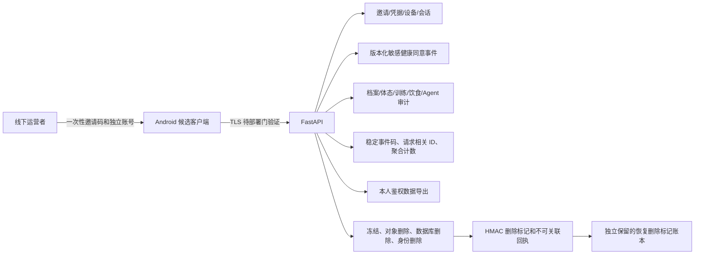

# Phase 9 受控试用数据生命周期

> 状态：Gate 2 内部工程审查稿，2026-08-12。仅使用合成数据验证，不是法律意见、
> 个人信息保护影响评估或真实数据处理授权。真实测试者、真实健康数据、生产凭据、部署和
> 分发仍被 `docs/product/public-release-gate.md` 阻断。

## 1. 固定边界

- 地区/受众：中国大陆一般健康成年人；非医疗诊断、治疗、康复或营养治疗。
- 渠道：Android 非公开小范围候选；唯一邀请码，每名测试者独立单机内测账号，凭据线下发放。
- Gate 2：只处理合成数据；不收集联系方式；照片、live AI、短信和邮件 provider 均关闭。
- 运营主体、真实存储位置、供应商、保留期限和用户可见文本尚未批准。下表中的期限是工程默认或
  待定项，不能直接成为真实处理承诺。

## 2. 数据流

## 3. 数据清单与最小化

| 类别 | 目的/必要性 | 来源与位置 | 可访问者 | 工程保留/删除语义 | 第三方 |
| --- | --- | --- | --- | --- | --- |
| 邀请 | 限定受众、一次性开通 | 运营者生成；`trial_invitations` 仅存 digest | 认证服务、受限运营者 | 原子消费；撤销/到期；删号删除 | 无 |
| 独立账号与凭据 | 登录及未来 provider 替换 | 用户输入；`trial_credentials` 存慢哈希 | 认证服务 | 禁用或删号删除；不导出哈希 | 无 |
| 设备绑定 | 单活动设备约束 | 客户端随机值；仅存 digest | 认证服务 | 换机撤销或删号删除 | 无 |
| 会话 | 短时 access、可轮换 refresh | 服务生成；refresh 仅存 digest | 认证服务 | 轮换/登出/禁用/删号撤销 | 无 |
| 同意事件 | 证明敏感健康目的的授予/撤回 | 用户动作；版本化追加事件 | 隐私门、本人导出 | 账号存续期；删号删除，保留非关联标记 | 无 |
| 健康档案/签到/体重 | 个性化确定性建议 | 用户输入；数据库 | 本人及受控服务 | 当前产品保留；删号全删 | 无 |
| 体态/训练/饮食 | 生成、执行和复盘 | 用户输入与确定性结果；数据库 | 本人及受控服务 | 当前产品保留；删号全删 | 无 |
| Agent 审计 | 受控工具调用和失败追踪 | 服务生成；数据库 | 本人相关服务、受限运维 | 现行短期保留策略；删号全删 | live provider 关闭 |
| 照片对象键 | 旧开发能力的删除兼容 | 数据库；候选禁止新建 | purge 服务 | 对象确认删除后才删 DB；无 adapter 时失败关闭 | 对象存储候选未批准 |
| 安全日志 | 认证/隐私失败和可用性聚合 | 服务生成；日志系统待定 | 受限运维 | 真实期限待批准；禁止正文、凭据、账号名和对象键 | 监控供应商未批准 |
| 删除标记 | 防止备份复活已删除身份 | HMAC(user UUID)；数据库及独立账本 | 恢复操作员 | 至少覆盖最长备份寿命；真实期限待批准 | 备份供应商未批准 |

## 4. 同意、访问、导出和撤回

1. `controlled_trial_sensitive_health` 是独立目的；事件包含 notice version、动作、单调序号和时间。
2. 只有当前版本最后一条为 `grant` 才能访问健康、体态、训练、饮食、Agent 和档案写入。
3. 撤回后上述路径立即 `403 privacy_consent_required`；身份摘要、同意状态、导出和删号仍可访问。
4. 告知版本变化使旧同意失效，不可静默迁移或推定同意。
5. 导出只允许当前 session 的本人，显式排除凭据哈希、邀请码/设备/refresh digest、审计 HMAC key
   和服务端 secret；格式为版本化 JSON。
6. Gate 3 必须提供中文可访问告知和撤回 UI。在此之前后端契约通过不代表候选可用。

## 5. 账号删除与备份

- 删除前必须用当前 provider 凭据和当前设备重新认证；错误凭据不产生任何删除。
- 删除先撤销全部会话，再复用有恢复能力的 purge 状态机：冻结写入、确认对象删除、删除全部领域
  数据、删除同意/邀请/设备/会话/凭据/User，最后在同一事务写入 HMAC 删除标记并清除可关联操作字段。
- 照片仍关闭。若历史对象键存在而真实对象删除 adapter 未配置，删除保持失败/冻结，不伪造成功。
- 删除标记不含 user UUID、账号名或健康正文。`PRIVACY_AUDIT_HMAC_KEY` 必须独立、稳定、轮换受控。
- 每次账号删除完成后及每次备份时，必须用 `python -m app.privacy.ledger export <受控路径>`
  保存带 HMAC 完整性证明的删除标记账本；恢复时先用 `import` 合并比备份更新的账本，再运行复活检测，
  然后才允许服务开放。候选启动检测到“标记 + 可登录身份”并存时直接失败。
- 旧备份不能作为回滚删除或同意撤回的手段。详细步骤见
  `docs/operations/phase9-controlled-trial-runbook.md`。

## 6. 仍阻断真实试用的外部事项

- 运营/个人信息处理主体、实际存储和备份地域、处理者合同与访问角色未确定。
- 真实保留期限、隐私告知、单独同意文本、用户支持流程和个人信息保护影响评估未批准。
- 法律/隐私、健康专业及独立安全审查均为 `not obtained`。Codex 的审查只覆盖工程实现与证据。
