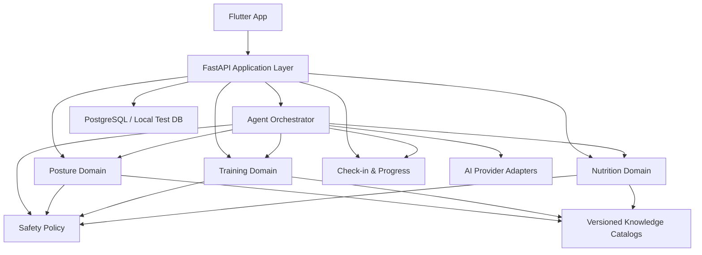

# 个人体态健康教练 Agent 总路线图

> 日期：2026-06-12
> 最近修订：2026-07-15（补充外部资产来源、许可、版本和代码引入边界）
> 基线：现有 Flutter + FastAPI 体态分析 MVP
> 目标：个人开发版可运行闭环

## 1. 路线图目标

把当前“体态问题浏览与评估工具”逐步演进为：

```text
体态评估
  -> 结构化体态档案
  -> 四周居家训练计划
  -> 每日签到与弹性调整
  -> 普通饮食推荐
  -> Agent 统一调用与解释
  -> 体态和执行趋势复盘
```

路线图按依赖关系排序，不按页面数量排序。每个阶段必须形成可运行、可验证的纵向能力，不能只完成数据库或界面的一半。

## 2. 总体架构方向

保持模块化单体，不拆微服务：



核心领域服务必须能够脱离聊天和模型独立运行，并产出完整、结构化、可校验的确定性基线结果。Agent 只通过受控工具调用这些服务；模型不可用时返回基线结果或明确的不可用状态。

## 外部资产与参考项目引入原则

外部仓库只能作为数据种子、设计对照或数据源调研输入，不能削弱本项目的确定性安全引擎、风险分级、隐私门和结构化长期记忆边界。

- 引入任何外部数据、媒体、代码或模型前，必须记录来源 URL、仓库 commit/tag 或数据发布版本、获取日期、许可、文件范围、版权例外、用途、修改方式和退出策略。
- 许可不兼容或授权不清的内容不得进入仓库、构建产物、演示数据或测试夹具。GPL-3.0 代码不得复制进本项目；需要使用 GPL 生态时只能记录设计启发，并重新实现。
- MIT 代码或数据也不能直接绕过安全规格。来自外部的动作、食物或计划数据必须经过本项目 schema、来源审查、安全字段补齐和自动化校验。
- 外部媒体按单独许可处理。没有明确可复用授权时，不得使用图片、视频、GIF、缩略图或预制餐食图；首版体态和动作图示优先自绘或使用已获授权资产。
- 不得因参考项目支持计费、排行榜、饮食记录、拍照识餐、视频跟练、实时动作识别或健身房器械训练，就扩大本项目首版范围。
- 任何健康、运动、营养、安全阈值和特殊人群策略必须回到当前权威来源或版本化策略数据，不能从参考仓库、旧计划或 LLM 输出转抄为安全规则。

## 3. 阶段总览

| 阶段 | 用户可获得的结果 | 核心交付 |
| --- | --- | --- |
| 0. 基线收敛 | 当前 MVP 可稳定作为后续基础 | 编码、测试、配置、文档和数据问题收敛 |
| 1. 体态核心产品化 | 选择部位并完成可信的图示自测或照片评估 | 图示库、来源与置信度、冲突结果、体态 Tools |
| 2. 健康档案与趋势 | 轻量签到、体重趋势、打卡网格 | 扩展档案、签到、体重、今日与我的页面 |
| 3. 训练知识与安全引擎 | 系统能安全筛选居家动作 | 动作库、禁忌、替代、风险策略和校验器 |
| 4. 四周训练计划 MVP | 用户确认并执行体态优先的居家计划 | 计划生成、今日任务、反馈和计划版本 |
| 5. Agent MVP | 通过对话或按钮使用同一套能力 | 上下文解析、Tool 调用、确认与审计 |
| 6. 饮食推荐 MVP | 获得训练日/休息日三餐与替换建议 | 营养计算、食物库、份量模板和图片 |
| 7. 弹性闭环与综合复盘 | 漏练、疲劳和趋势变化后得到合理调整 | 自动小调整、周复盘、体态复查和综合建议 |
| 8. 个人开发版验收 | 完整核心流程可在 Android 本地运行 | 端到端验证、评测集、数据重置和演示数据 |

## 4. 阶段 0：基线收敛

### 目标

确认当前仓库真实状态，避免在编码损坏、配置硬编码或过时文档上继续扩展。

### 交付

- 核对并修复源码中文编码问题
- 明确 Python、Flutter、数据库和 Android 运行版本
- 将 API 地址改为可配置环境
- 清理无效运行产物和异常文件
- 恢复并运行后端测试、Flutter analyze 和 Flutter 测试
- 为当前体态 API 补齐关键 response schema
- 明确个人验证期的数据模式：隐私门完成前仅使用合成数据；门完成后才可按已告知的边界使用开发者本人数据；测试和评测始终仅使用合成档案
- 定义真实敏感数据的告知、同意、云端处理、保存期限和删除基线
- 将旧计划标记为历史资料，不再作为当前完成状态
- 建立新的 `docs/product`、`docs/architecture`、`docs/specs/<domain>` 文档体系

### 退出标准

- 新环境可按明确命令启动前后端
- 当前体态主流程可运行
- 测试和分析结果有新鲜证据
- 后续模块使用的运行时和配置方式已确定
- 数据模式和真实敏感数据启用门已记录，未满足时相关上传能力保持关闭

### 不包含

- 新训练、饮食或 Agent 功能

### 完成状态

阶段 0 已于 2026-07-11 完成。验收标准 1-9 全部满足：

- 新环境可按明确命令启动前后端（README 含 DATABASE_URL → `alembic upgrade head` → uvicorn 完整顺序）
- 当前体态主流程可运行（真实 PostgreSQL + 真实后端 + Android 完整业务冒烟通过）
- 测试和分析结果有新鲜证据（后端 81 passed、Flutter analyze 无问题、Flutter test 7 passed）
- 运行时和配置方式已确定（Python 3.9.13、Flutter 3.44.0、PostgreSQL 16、Alembic、Dart-define）
- 数据模式和真实敏感数据启用门已记录，照片分析默认关闭
- 详见 `docs/specs/platform/2026-06-12-baseline-contract.md` 和 `docs/plans/platform/2026-06-12-baseline-convergence.md`

## 5. 阶段 1：体态核心产品化

### 目标

把现有体态 MVP 转化为 Agent 可调用、用户可理解、结果可追踪的核心能力。

### 交付

- 用户自行选择关注部位和问题
- 统一风格的自测图示、正确步骤、常见错误和停止条件
- 图示自测与 AI 照片分析保留独立来源
- 评估记录增加来源、置信度、状态和版本
- 冲突结果进入“不确定”状态
- 多问题优先级建议和用户确认流程
- 体态结果页增加“生成改善计划”入口，但暂不生成正式训练计划
- 将当前能力包装为体态 Tools：
  - `list_posture_issues`
  - `get_posture_issue`
  - `guide_posture_self_test`
  - `analyze_posture_photo`
  - `get_posture_profile`
  - `suggest_posture_priorities`

### 安全工作

- 重新核对现有问题库的医学来源和红旗提示
- 关联图谱只输出“可能关联”
- AI 解析失败不得落库为正常
- 图像与健康数据日志脱敏
- 真实照片处理前完成目的告知和适用的单独同意；未同意时不上传并保留图示自测路径
- 记录照片是否进入云端模型、使用的提供者边界、保存期限和删除结果

### 退出标准

- 用户可完成至少一个部位的图示自测
- 照片和自测冲突能够正确展示
- 体态档案明确区分已评估与未评估区域
- Tool 输出全部通过类型校验和权限检查
- 新安全信号会使旧资格判断失效，并在继续建议前重新执行风险分类

### 完成状态

阶段 1 已于 2026-07-22 由用户签核完成。验收证据见：

- `docs/reports/phase1-exit-audit-2026-07-22.md`
- `docs/specs/posture/2026-07-11-posture-core-productization.md` §17.2
- 主分支 `a886e86`

最终验收结果：

- 后端全量测试 `599 passed`，0 skipped，包含 PostgreSQL 16.14 真实 PG 集成路径
- Flutter `analyze` 通过，Flutter 全量测试 `196 passed`
- Android 模拟器冒烟覆盖登录、问题详情、自测、档案、历史、照片门、优先级、目标确认和安全信号
- Phase 1 未启动训练计划生成、Agent 对话或饮食推荐；照片分析仍由隐私门硬拒绝

## 6. 阶段 2：健康档案、签到与趋势

当前规格：`docs/specs/platform/2026-07-22-health-profile-checkins-trends.md`

当前计划：`docs/plans/platform/2026-07-22-health-profile-checkins-trends.md`

### 目标

建立训练调整所需的结构化数据，不先依赖聊天历史或穿戴设备。

### 交付

- 扩展健康档案：
  - 健身目标
  - 训练经验
  - 每周 2 至 5 次频率
  - 单次可用时间
  - 徒手和弹力带条件
  - 疼痛、伤病、限制
  - 过敏和明确忌口
- 20 秒每日签到
- 异常疼痛的条件式安全追问
- 可选体重记录
- 体重散点和移动趋势曲线
- 计划执行打卡网格
- 主动休息和安全调整作为有效状态
- 今日页与计划页的数据职责分离

### 退出标准

- 缺失数据不会被 AI 自动猜测
- 用户可在 20 秒左右完成普通签到
- 体重趋势不依据单日波动给出调整
- 切换账号或退出后不残留上一用户的健康数据
- 用户可查阅、更正和删除真实健康档案，保存期限规则可验证

### 完成状态

阶段 2 **尚未标记完成**（2026-07-26 Task 8 退出审计）：自动化验证与 PostgreSQL 真实集成证据齐备，但 **Android 模拟器冒烟未执行**，按 Task 8 契约与 §13 规则暂不标记完成，状态为“有条件通过，待 Android 冒烟补齐”。证据与逐条核对见 `docs/reports/phase2-exit-audit-2026-07-26.md`。

- 后端 `798 passed`（含真实 PostgreSQL 16 集成，0 skipped）；Phase 2 E2E `6 passed`；迁移单一头 `0006_health_weight_tracking`。
- 后端 ruff `app tests` clean；一次性 PG16 容器裸 CLI `alembic upgrade head/current` 通过。
- Flutter `analyze` 无问题；`flutter test` `300 passed`。
- 待补：Android 模拟器冒烟（登录→我的健康档案→今日签到→异常疼痛追问→体重→趋势/网格→登出/账号切换）。

## 7. 阶段 3：训练知识与安全引擎

### 目标

先构建可验证的训练领域能力，再让 Agent 生成计划。

### 交付

- 结构化居家动作库：
  - 徒手和弹力带
  - 热身、力量、体态纠正、灵活性和恢复
  - 目标肌群、动作模式、难度和器械
  - 适用体态信号
  - 禁忌、停止条件
  - 简化、进阶和替代动作
  - 图示资源
- 动作库数据种子来源与许可记录：
  - `hasaneyldrm/exercises-dataset` 只能评估其 MIT 覆盖的非媒体数据作为基础元数据种子，例如动作名、解剖分类、器械、目标肌群、协同肌群、多语言说明和 JSON Schema 思路
  - `images/`、`videos/`、GIF、缩略图和其他 Gym visual 媒体不进入本项目，除非另行取得可验证授权；当前阶段按自绘动作图示处理
  - 外部动作分类必须映射到本项目的体态问题、居家设备和安全策略分类，不能直接作为体态适配结论
  - 健身房器械、杠铃、史密斯机、固定器械等超出首版范围的动作默认排除，除非后续路线另行批准
- 在外部动作字段基础上扩展本项目动作 schema，至少补齐并强制校验：
  - 适用体态信号和不适用体态信号
  - 禁忌、停止条件和红旗触发说明
  - 简化、进阶和替代动作关系
  - 训练量、恢复间隔和进阶/回退规则
  - 安全来源、内容版本、审查状态和最后复核时间
- 将 `Snouzy/workout-cool` 的 Prisma 模型作为训练领域数据模型对照样本，重点核对 exercise、workout、plan、progress 的字段关系是否覆盖动作、计划、执行和进度追踪；不得引入其代码，也不得继承其缺少风险分级、禁忌、停止条件和安全校验器的设计
- 版本化训练安全策略
- 用户风险分级
- 受限模式的训练硬阻断、有限教育能力和恢复条件
- 候选动作过滤器
- 多体态问题的动作去重和冲突处理
- 训练量、恢复间隔和进阶规则
- `validate_training_plan` 安全校验 Tool

### 退出标准

- 给定合成用户档案，可确定性地产生允许动作集合
- 禁忌动作不会进入候选集
- 特殊和红旗案例进入正确限制路径
- 受限案例不会生成普通自动训练计划；红旗案例不会通过替换或调整继续训练
- 动作和规则有来源、版本和自动化测试
- 动作种子来源、许可、commit/tag、导入范围、字段映射和媒体排除记录可追溯
- 动作 schema 缺少禁忌、停止条件、替代/进阶/简化、适用体态信号、训练量规则或来源审查状态时，不能进入可推荐动作集合
- 阶段 3 规格包含 workout-cool 对照矩阵，并明确本项目训练知识、安全引擎和执行记录模型的差异

## 8. 阶段 4：四周训练计划 MVP

### 目标

用户能够从体态结果页或按钮生成、确认并执行四周计划。

### 交付

- 用户确认主要体态改善目标
- 四周计划草案生成
- 支持体态改善、减脂和基础增肌塑形
- 每周频率和单次时间由用户选择
- 计划结构：
  - 周期
  - 周安排
  - 当日训练任务
  - 动作处方
  - 进阶和恢复规则
- 今日任务支持完成、部分完成、太忙、主动休息和身体不适
- 每个动作展示图示、步骤、次数、休息和替代项
- 计划版本和变更原因
- 用户确认后生效
- 将 `Snouzy/workout-cool` 的 Prisma 模型作为设计对照样本，重点核对计划结构、周结构、当日训练、动作处方、执行记录和进度追踪字段完整性
- 明确记录对照后保留和拒绝的设计：可参考周期、周、session、exercise prescription、progress 的结构关系；不得照搬缺少风险分级、禁忌、安全校验和体态优先入口的模型

### AI 边界

- 确定性引擎生成完整、可执行的结构化基线计划，而不只是候选和训练量边界
- AI 只在允许范围内负责偏好适配、解释和个性化表达，不得改变资格判断、禁忌或训练量上限
- AI 输出必须再次经过 schema 和确定性安全校验
- 模型不可用时展示基线计划或明确不可用状态，不得产生未经校验的降级计划

### 退出标准

- 至少覆盖普通、谨慎、受限和红旗合成案例
- 用户可完整执行一天并记录反馈
- 计划中的每个动作都能追溯到动作库
- 计划生成失败不会产生半生效状态
- 每次生成、替换和当日调整前都使用最新档案与签到重新执行风险分类
- 阶段 4 规格包含 workout-cool 对照矩阵，并说明本项目因安全引擎、体态优先和用户确认流程所做的差异

## 9. 阶段 5：Agent MVP

### 目标

让按钮操作与聊天操作调用同一套领域能力，避免形成两套业务逻辑。

### 交付

- Agent 对话入口
- `Context Resolver` 按入口和意图组装最小上下文
- 只保存结构化档案和确认后的状态，不把完整聊天作为长期记忆
- 所有推荐和调整 Tool 在执行副作用前重新运行资格与风险安全门
- 首批 Tools：
  - 健康档案查询
  - 每日签到和体重记录
  - 体态检查与档案查询
  - 训练计划草案生成
  - 今日训练查询
  - 动作替换
  - 当日小调整
  - 训练结果记录
  - 风险分类与计划校验
- Tool 调用授权、幂等和审计
- 重要调整的差异展示和确认

### 上下文策略

客户端传递入口类型和实体 ID，后端按需组合：

```text
档案摘要
+ 风险等级
+ 相关体态结果
+ 当前生效计划
+ 今日签到
+ 当前任务
+ 最近结构化反馈
```

### 退出标准

- 从动作任务打开 Agent 时能够理解当前动作
- Agent 无法越权修改长期计划
- Prompt 注入不能绕过安全 Tool
- 对话与按钮生成的计划使用相同服务和校验器
- 模型失败不会被解释为正常、健康或已成功执行

## 10. 阶段 6：饮食推荐 MVP

### 目标

根据身体状态、目标和训练计划生成普通饮食建议，不建设记录系统。

### 进入前必须确定

- 采用的营养计算公式与适用范围
- 中国常见食物数据来源及许可
- 食材与餐食图片来源及许可
- 份量单位和估算区间
- Open Food Facts、USDA FoodData Central 和自有托管精选子集是否作为候选方案，以及每个候选的许可、版本、更新频率、可商用条件、署名要求、数据质量限制和中国常见食材覆盖
- Open Food Facts 若进入候选，必须单独评估 ODbL 数据库许可、Database Contents License、产品图片 CC BY-SA 及商标/包装版权风险，不默认合并进闭源或私有食物库
- USDA FoodData Central 若进入候选，必须记录 CC0/public domain 状态、下载批次或 API 版本、引用格式、字段定义和本地缓存策略
- 自有托管食物库必须记录来源 lineage、原始许可证、转换脚本版本、字段映射、人工校对状态和可删除/可更新策略
- 任何 DRI/IOM 或膳食指南参考值必须从权威原始来源独立核对并记录版本，不得从 OpenNutriTracker 或其他应用代码转抄
- `simonoppowa/OpenNutriTracker` 只作为数据源组合、隐私思路和本地存储启发；GPL-3.0 代码、UI、业务逻辑、导入管线和追踪功能不得复制或移植
- 重申首版不做饮食记录、拍照识餐、摄入统计、饮食打卡、条码扫描和营养追踪器式日记

### 交付

- 确定性营养目标计算
- 受限模式的饮食硬阻断、有限教育能力和恢复条件
- 训练日与休息日的目标差异
- 中国常见食物结构化数据库
- “碗、掌、拳”等份量转换
- 三餐模板
- 同类食物替换
- 标准食材真实图片和少量预制餐食图
- 饮食建议草案、校验和用户确认
- Agent Tools：
  - `calculate_nutrition_targets`
  - `convert_targets_to_portions`
  - `generate_meal_plan_draft`
  - `replace_food`
  - `validate_nutrition_plan`

### 退出标准

- 过敏和忌口食物不会出现在计划中
- 同一目标可生成多个等价替换
- UI 不展示超出估算能力的虚假精确值
- 不支持范围能够明确提示，不伪装成完整支持
- 受限案例不会生成普通自动饮食计划，且每次计算、生成和替换前重新执行风险分类
- 模型不可用时，确定性营养目标、份量换算和排除规则仍可独立运行
- 食物数据和图片来源、许可、版本、字段映射、质量限制、更新策略和下架策略可追溯
- 验收时不存在 GPL-3.0 代码复制，也不存在饮食记录、拍照识餐、摄入统计或条码扫描等超出首版范围的功能

## 11. 阶段 7：弹性闭环与综合复盘

### 目标

让系统根据现实执行情况做出保守、可解释的调整。

### 交付

- 当日自动小调整：
  - 缩短训练
  - 低优先级任务删除
  - 恢复训练替换
  - 合理顺延
- 每次自动调整前重新执行资格与风险分类；新安全信号立即使旧资格判断失效
- 长期调整提议：
  - 周结构变更
  - 强度进阶或回退
  - 主要目标调整
- 连续漏练不简单堆积任务
- 每周复盘
- 体重趋势和计划执行趋势综合分析
- 体态复查提醒与前后变化
- 普通提醒可由用户关闭；安全提醒不受普通提醒开关影响

### 退出标准

- 忙碌、疲劳、漏练、主动休息和疼痛案例均有明确行为
- 自动调整不会破坏恢复间隔和训练量上限
- 红旗案例停止相关执行，不通过缩短、顺延或恢复性替换绕过阻断
- 所有长期变化需用户确认
- 用户能查看调整原因和历史版本

## 12. 阶段 8：个人开发版验收

### 目标

形成一个可重复演示和继续迭代的 Android 本地产品。

### 交付

- Android 端到端核心流程
- 合成演示用户和可重置数据
- 后端、Flutter 和安全评测命令
- 训练与 Agent 合成评测集
- 关键失败状态和离线/重试体验
- 数据清除工具
- 本地运行文档
- 已知限制清单
- 公开发布前合规门清单，包括隐私、模型信息和 AI 生成合成内容标识

### 核心验收流程

```text
登录
-> 选择部位
-> 完成图示自测或照片分析
-> 查看体态档案
-> 发起并确认四周计划
-> 完成每日签到
-> 执行或调整今日任务
-> 查看打卡网格和体重趋势
-> 通过 Agent 解释或调整
-> 获取饮食推荐
-> 完成周复盘和体态复查
```

### 不作为当前验收门槛

- 面向公众的短信、备案和商业部署
- 大规模并发
- iOS 发布
- 可穿戴设备
- 在线支付和会员体系

面向中国大陆公众发布不属于当前个人开发版验收，但必须另设发布门：评估并实现适用的 AI 生成合成内容显式标识、导出文件标识保留、隐式元数据、来源追踪、用户协议说明、应用商店审核材料，以及发布时现行法规要求的备案、安全评估和隐私合规工作。

## 13. 跨阶段质量门

每个阶段完成前必须验证：

- 规格验收条件
- 后端相关测试
- Flutter analyze 和相关测试
- API 与 AI schema
- 普通、谨慎、受限和红旗案例
- 每个推荐、替换和调整入口的重新风险分类
- 权限和账号数据隔离
- 敏感数据日志
- 告知、同意、保存期限和删除路径
- 失败和重试路径
- 无模型时的确定性基线或明确不可用状态
- 外部数据、代码、媒体、模型和参考项目的来源、许可、版本、commit/tag、用途、修改范围、署名要求和排除项
- 外部资产许可兼容性，包括 GPL/copyleft、ODbL/share-alike、CC BY-SA、第三方媒体版权和商标/包装图片风险
- 外部数据字段经过本项目 schema、安全策略、来源审查和质量校验；缺少必需安全字段时不能进入推荐路径
- 外部参考项目只作为对照时，规格中必须写明不引入代码、不扩张范围、不弱化安全边界
- 文档与当前行为一致

不能仅因为页面存在或模型能返回文本就判定功能完成。

### 13.1 分层验证与 GitHub CI 策略

目标是在不阻塞本地开发反馈的前提下，减少 Codex/OpenCode 重复运行全量测试、等待环境安装和读取长日志的成本。CI 是统一验证门和集成兜底，不替代本地相关测试、Codex 真实 diff 审查、安全判断或人工冒烟。本策略只覆盖 CI；自动部署、发布和其他 CD 外部写入仍需用户明确授权。

验证分为三层：

| 层级 | 触发时机 | 必需内容 | 结果用途 |
| --- | --- | --- | --- |
| Local focused | 每个 Task 实现和审查期间 | 受影响测试、lint/analyze、`git diff --check`；迁移、安全或契约变更增加对应专项验证 | 保持快速反馈；实现报告和 Codex 审查的最低证据 |
| Fast CI | 已审查候选 commit push 后 | 静态检查、路径相关测试、OpenAPI/schema 检查、敏感文件检查；目标 3-6 分钟但不作为硬验收时限 | 发现环境差异和遗漏；普通 Task 的远程候选验证 |
| Full CI | 高风险 Task、集成节点、Phase 退出或手动触发 | 后端与 Flutter 全量测试、真实 PostgreSQL/迁移演练、安全与隐私套件、必要构建和 E2E | 合并与阶段退出证据；仍不能替代目标设备人工冒烟 |

每个 Phase 的实施计划必须为每个 Task 标明 Local、Fast CI 和 Full CI 要求。默认矩阵如下：

| Task 类型 | Local focused | Fast CI | Full CI |
| --- | --- | --- | --- |
| 纯文档/治理 | 链接、格式、状态一致性和 diff check | 可与下一候选批次合并 | 通常不需要 |
| 普通局部后端或 Flutter | 必须 | 候选分支必须 | 可延后到最近集成节点 |
| API/OpenAPI/跨端契约 | 必须 | 必须 | 契约两端集成后必须 |
| 迁移、鉴权、隐私、健康安全、AI 边界 | 必须 | 必须 | 候选 commit 和集成后均必须 |
| 多个无高风险依赖的相邻 Task | 各自必须 | 各自或小批次 | 可在共同集成节点运行一次 |
| Phase 最终 E2E/退出审计 | 目标流程先本地验证 | 必须 | 必须；另执行计划规定的人工/设备验证 |

执行约束：

- 不为每个 Task 复制 workflow；使用共享验证脚本和可复用 workflow，以路径和风险标签选择 job。
- 实现 Agent 不等待或高频轮询 CI；CI 完成后，Codex 先读取结论摘要，仅在失败定位需要时读取对应 job 的局部日志。
- CI 必须生成短摘要，至少包含 commit SHA、job、结果、失败测试、第一处有效错误和报告 artifact；测试默认安静输出，并保留 JUnit 等机器可读报告。
- 同一分支只保留最新运行，取消过时 run；依赖缓存用于节省时间，不缓存敏感数据，并为 job 设置超时。
- 第三方 Action 固定到审查过的 commit SHA，默认 `contents: read` 最小权限；只使用合成数据，不接入生产密钥、真实健康数据或真实照片。
- 路径过滤不能单独豁免共享 schema、基础配置、迁移、安全、鉴权或隐私测试；风险标签优先于路径优化。
- CI 证据只对被验证的 commit SHA 有效。rebase、冲突修复、集成或实质改动后必须重跑相应层级。
- 仓库尚未配置 GitHub Actions 时，计划中列出的本地验证仍是当前证据；不能把“计划采用 CI”写成“CI 已通过”。CI 落地应使用独立平台 Task，并在审查后再申请 push/PR 授权。

从阶段 3 起，在第一个需要远程候选验证的实现 Task push 前，先建立独立 CI foundation Task：提供共享本地验证入口、Fast CI、手动/集成触发的 Full CI 和短摘要 artifact；不包含自动部署。后续 Phase 只扩展验证矩阵，不复制整套 workflow。

## 14. 当前优先级

立即执行顺序：

1. 阶段 0：基线收敛
2. 阶段 1：体态核心产品化
3. 阶段 2：健康档案、签到与趋势
4. 阶段 3 和阶段 4：训练知识、安全引擎及计划 MVP

Agent 对话层和饮食推荐不应先于这些可信领域能力完成。

完成阶段 0 后，为阶段 1 单独编写规格和实施计划；不要直接用本路线图指导具体文件修改。
