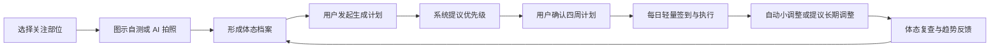

# 个人体态健康教练 Agent 产品愿景

> 日期：2026-06-12
> 阶段：个人开发验证
> 首发：Android，中国大陆，中文

## 1. 产品定义

这是一个**以体态评估为核心的个人健康教练 Agent**。

产品首先帮助用户了解和持续追踪自己关注的体态问题，再基于已确认的体态档案、健身目标、可用时间和身体反馈，生成并动态调整居家训练计划与普通饮食建议。

产品属于健康管理和健身辅助工具，不提供医疗诊断、治疗或专业康复替代服务。

## 2. 目标用户

首版服务两类高度重叠的成年人：

- 有居家健身需求，希望减脂或进行基础增肌塑形的人群
- 关注圆肩、头前倾、骨盆前倾等问题，存在体态焦虑的人群

所有用户都可以使用问答和体态检查辅助。系统根据风险等级限制建议强度，而不是简单拒绝特殊人群，也不依靠免责声明代替风险控制。

## 3. 核心原则

1. **体态安全优先**：健身目标与体态安全冲突时，优先降低风险。
2. **用户主动生成**：体态评估后不自动创建计划，用户通过按钮或 Agent 对话发起。
3. **规则守底线，AI 做个性化**：确定性规则负责风险、禁忌、计算、候选生成和校验，并能独立产出可执行的结构化基线方案；AI 只在允许范围内负责理解、偏好适配、解释和交互。
4. **计划可执行**：优先提供动作任务、份量模板和替换项，不先建设复杂课程、视频跟练或自动动作识别。
5. **允许现实偏差**：漏练、加班、疲劳和主动休息是正常状态，系统应合理重排而不是惩罚用户。
6. **中性表达体态**：展示单项结果、置信度和趋势，不生成全身总分、排名或制造问题数量焦虑。
7. **长期记忆结构化**：长期保存档案、计划、签到和明确确认的偏好，不依赖完整聊天记录作为用户事实。

## 4. 核心用户闭环

## 5. 产品信息架构

底部导航采用四个主入口：

| 入口 | 职责 |
| --- | --- |
| 今日 | 今日签到、训练任务、合理休息、快捷记录和 Agent 调整入口 |
| 计划 | 四周训练计划、训练日安排、饮食建议和计划版本 |
| Agent | 问答、体态检查、计划生成、解释、替换和调整 |
| 我的 | 健康档案、体态档案、体重趋势、打卡网格、偏好和数据管理 |

今日页只负责“今天做什么和发生了什么”；计划页负责“未来如何安排以及为什么这样安排”。

## 6. 体态能力

- 用户自行选择关注部位，不强制完成全身检查
- 支持图示引导自测和 AI 拍照分析
- 每项结果保留评估来源、时间、等级、置信度和已评估范围
- 两种方式冲突时标记为不确定，不强行合并为确定结论
- 多项问题并存时，系统根据关联资料和确定性规则提出改善优先级，Agent 可负责解释
- 优先级属于建议，用户确认主要改善目标后再生成计划
- 自测步骤需要清晰、统一风格的图示

## 7. 训练能力

首版范围：

- 居家训练
- 徒手与弹力带
- 每周 2 至 5 次，由用户选择
- 用户选择单次可用时间
- 支持体态改善、减脂和基础增肌塑形
- 生成四周计划，每周可根据执行和状态调整

每个动作任务至少包含：

- 动作图示
- 动作目的和适用原因
- 组数、次数或时长、休息
- 注意事项和停止条件
- 简化动作、进阶动作和替代动作

系统可以在每次重新执行风险分类和安全校验后，自动完成当日缩短、顺延或恢复性替换并告知用户；改变每周结构、长期强度或主要目标时必须由用户确认。出现明确安全风险时，安全策略可直接停止相关动作，并且不得自动生成替代训练绕过停止条件。

## 8. 每日签到与进度

20 秒轻量签到包含：

- 睡眠质量：差、一般、好
- 当前精力：低、正常、充足
- 肌肉酸痛：无、轻微、明显
- 异常疼痛：无或有；选择“有”时进入安全追问
- 今日可用时间：无、15 分钟、30 分钟、45 分钟以上

体重为可选记录，不要求每天填写。趋势使用原始散点和移动趋势线，避免依据单日波动调整计划。

每日执行情况使用类似 GitHub Contribution Grid 的网格展示：

- 无记录
- 完成签到
- 部分执行
- 完成主要计划
- 主动休息或安全调整

主动休息和安全调整属于有效健康管理，不视为失败。

## 9. 饮食推荐

首版只做推荐，不做饮食记录、拍照识别、摄入统计或饮食打卡。

输入包括：

- 身体档案和体重趋势
- 减脂、维持或基础增肌目标
- 四周训练计划和当日训练类型
- 普通饮食偏好
- 食物过敏和明确忌口

输出采用：

- 每日营养和食物份量目标
- 中国常见食材的三餐模板
- 同类食物替换方案
- 训练日和休息日的差异说明
- 真实标准食材图片和少量预制餐食示例图

用户界面使用“一碗、一掌、一拳”等易理解份量；内部使用结构化食物数据换算估算区间。不能由大模型凭感觉生成虚假的精确营养值。

首版不宣称支持素食、清真或疾病治疗饮食。

## 10. Agent 权限

Agent 通过受控 Tools 工作，不直接任意读写数据库。即使模型不可用，核心体态、训练和饮食领域服务仍应能够返回确定性结果或明确的不可用状态，不得把模型失败解释为健康或正常。

主要能力包括：

- 查询和更新结构化健康档案草案
- 引导体态自测和发起照片分析
- 查询体态档案并提出问题优先级
- 生成和校验训练计划草案
- 获取今日任务并执行小范围调整
- 记录训练结果、签到和体重
- 生成和校验饮食建议
- 汇总体重、执行率和体态复查趋势

重要状态变更采用“建议 -> 规则校验 -> 展示差异 -> 用户确认 -> 执行”的流程。

## 11. 成功指标

个人开发阶段优先验证：

1. 用户能否完成体态检查并理解结果
2. 用户能否生成并开始执行四周计划
3. 计划是否能在漏练和状态变化后保持可执行
4. 用户是否持续签到和完成合理安排
5. 体态复查、主观身体状态和疼痛趋势是否得到改善

首要产品指标是计划执行率和持续使用；体态与身体感受变化属于结果指标。

## 12. 首版明确不做

- 医疗诊断、治疗和专业康复方案
- 健身房器械训练
- 完整视频课程和实时动作识别
- 饮食记录、拍照识餐和实际摄入统计
- 素食、清真和疾病治疗饮食
- 穿戴设备接入
- 全身综合体态评分和用户排名
- 依赖完整聊天记录的长期记忆
- 面向公众发布所需的完整运营、备案和规模化基础设施
